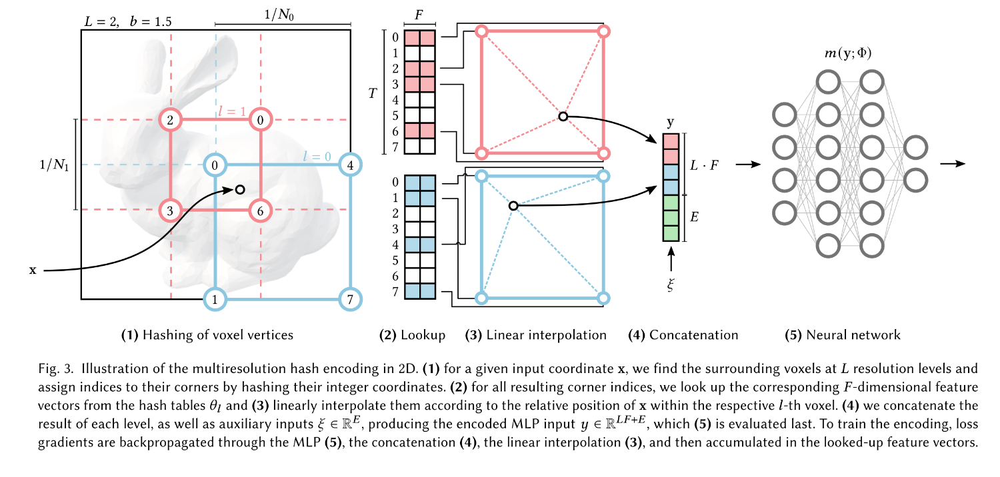

对于NeRF相关的一些论文的阅读感悟

### [NeRF_Survey](https://originf.github.io/files/NeRF Survey.pdf)

- 。。。

### [NeRF](https://originf.github.io/files/NeRF.pdf)

- 方法比较粗暴，直接采用了两个8层MLP神经网络（coarse，fine）

- 首次coarse采用均匀采样，fine采用的是重要性采样。

- 网络的结构如下：

  

- NDC下的归一化空间位置$\gamma(x)=(x,y,z)$

- 世界坐标系下的沿视线距离$\gamma(d)=d$

- 输出为空间点$(x,y,z)$的密度$\sigma \in [0,1]$,（这里的密度和透明度$\alpha$和为1）

- 输出为空间点$(x,y,z)$的颜色$(r,g,b)$

- 一些数据集的数据中，内参矩阵中y和z都是负的，需要正则化

- 输入的数据x和d均是通过了位置编码（Position Encoding）传入的，可以减少高频图像的敏感度

### [LLFF](https://originf.github.io/files/LLFF.pdf)

- 沦为NeRF的数据库了属于是
- 数据库下载链接：[Download](https://github.com/Fyusion/LLFF)

### [MVP](https://originf.github.io/files/Faster_interface.pdf)

- 方法真的拉

- 认识到当结合多个网络的时候可以添加$\lambda$用来选择损失函数的重要性

- VAE中，Encoder实际上用处不大，现在常用的只有四种方法，需要的时候可以来这篇文章看。

- VAE中，训练完之后，我们主要是用的是Decoder，输入为高斯噪声，输出为我们需要的图像，同时，图像隐式的存储在VAE Decoder中。

- 训练VAE常常采用交叉熵的方法来计算Loss：
  $$
  H(p,q) = \sum_{x}{p(x) \times log(\frac{1}{q(x)})}
  $$

- 纯粹的叠叠乐文章，不知道为啥能中siggraph

### [NSVF](https://originf.github.io/files/NSVF.pdf)

### [InstantNeRF(5s)](https://originf.github.io/files/5s_NeRF.pdf)

- 这篇真的nb啊

- position-encoding：

  - 所有的空间表示原语的神经网络方法，往往都是用了Encoding的方法，将低维输入映射到高维空间中去。（原文：which is key for extracting high approximation quality from compact models.）

  - 5D light的含义为 $x(3D)+d(2D)$，三维的空间位置$(x,y,z)$，和二维的空间方向$(\theta,\phi) \iff norm(d_x,d_y,d_z)$。每一维加密的时候都采用了独立通过poistion-encoding。

  - *frequency encodings* 方法是一种类NeRF算法中的position-encoding技巧，具体的论文有*wavefronts [Tancik* et al. 2020] and level-of-detail filtering [Barron et al. 2021a].

  - 往往位置编码之后会紧跟一个转移矩阵用来近似可见性函数等。*[Annen et al. 2007; Jansen and Bavoil 2010]*

  - one-hot encoding:按照类别数N产生一个长为N的二进制序列，对应类别置1，其他类别置0。防止产生一些错误的信息。<u>但是可能会丢失顺序信息。</u>

  - one-blob encoding:

    An important consideration is the encoding of the inputs to the network. We propose to use the one-blob encoding—a generalization of the one-hot encoding—where a kernel is used to activate multiple adjacent entries instead of a single one. Assume a scalars ∈ [0, 1] and a quantization of the unit interval into k bins (we use k = 32). The one-blob encoding amounts to placing a kernel (we use a Gaussian with σ = 1/k) at s and discretizing it into the bins. With the proposed architecture of the neural network (placement of ReLUs in particular), the one-blob encoding effectively shuts down certain parts of the linear path of the network, allowing it to specialize the model on various sub-domains of the input. In contrast to one-hot encoding, where the quantization causes a loss of information if applied to continuous variables, the one-blob encoding is lossless; it captures the exact position of s

    简单来说就是将连续域上划分为很多个bins，然后根据高斯核函数完成one-hot编码。

    效果比frequency encoding要好得多

    - 一些概念解释：

      - kernel：机器学习中的kernel表示的是一个核函数：$kernel(R^n,R^n) = R^+$ 表示两个向量之间的距离。而高斯核函数表示的是
        $$
        k(x_1,x_2) = e^{-\frac{||x_1 - x_2||}{2\sigma^2}}
        $$

  - *Parametric encodings*：采用一些数据结构替代编码，主流是使用网格的格点进行编码，此时，在输入一个pixel的时候，只需要更新8个位置即可。同时，可以极大的加快编码的效率。

  - 一个不错的解读各种编码方式的文献：[https://zhangtemplar.github.io/nerf-encoding/](https://zhangtemplar.github.io/nerf-encoding/)

  - 使用了双线性插值的方法，具体的方法图如下：

    

    说明：分为L层，每层的分辨率不同，从小到大。每一层都找到一个该点对应的网格的位置，使用四周的四个点的双线性插值获得这个点的插值结果（F=2维），连接之后与$\xi$拼接，产生特征向量。每次梯度下降反向传播的时候:

    $$MLP\rightarrow Concatenation\rightarrow Linearpolation\rightarrow lookup$$，最终修改对应的那些grid对应的feature vector（特征向量的值）。

- latend feature（我的翻译是特征词）解释：To elaborate, the document could have observed features (words) like [sail-boat, schooner, yatch, steamer, cruiser] which would 'factorize' to latent feature (topic) like 'ship' and 'boat'.

- *hyper-parameter* 超参数：表示在训练之前就知道的参数信息。
